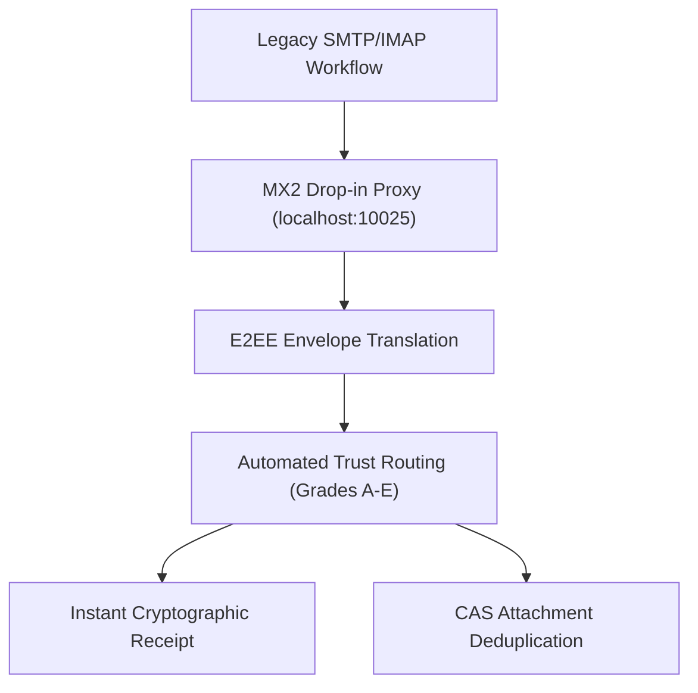

# MX2 Quality of Life (QoL) & Migration Roadmap

This document outlines the key Quality of Life (QoL) features that make **MX2 (Mail eXchange 2.0)** an obvious, frictionless, and logical upgrade over legacy 40-year-old SMTP/IMAP protocols.

---

## 🚀 Why Upgrade to MX2?

Legacy email relies on insecure, unencrypted, and easily spoofed protocols (SMTP, IMAP, POP3) patched over decades with fragile overlays (SPF, DKIM, DMARC). 

MX2 replaces this legacy architecture with **native End-to-End Encryption (HPKE X25519/AES-GCM)**, **Decentralized Identifiers (DIDs)**, and **Automated Trust Routing**.

---

## 🌟 Top 6 QoL Features for Enterprise & User Migration

### 1. 🔄 100% Backward-Compatible Drop-In Proxy (`localhost:10025` / `10143`)
- **Problem**: Migrating thousands of employees to a new protocol requires updating client software and breaking workflows.
- **MX2 QoL Solution**: The MX2 gateway runs a local loopback proxy on `10025` (SMTP) and `10143` (IMAP). Standard email clients (Thunderbird, Apple Mail, Outlook) connect without any code modifications. Outbound Mails sent to MX2-enabled domains are transparently upgraded to E2EE envelopes; legacy domains fall back to standard SMTP.

### 2. ⚡ Instant Cryptographic Delivery Receipts (<500ms)
- **Problem**: Senders have no reliable proof that an email arrived or was verified ("Did you get my email?").
- **MX2 QoL Solution**: Upon envelope receipt, the receiving gateway domain generates a verifiable **Ed25519-signed Delivery Receipt** containing the SHA-256 digest of the message envelope. The sender receives non-repudiable proof of delivery down to the millisecond.

### 3. ⏱️ Sender Revocation Window ("Undo Send")
- **Problem**: Once an SMTP email is dispatched, it cannot be recalled.
- **MX2 QoL Solution**: MX2 envelopes support a configurable 30-second key-hold window. If a user clicks "Undo Send", the ephemeral key exchange payload is revoked, rendering the envelope permanently undecryptable by the recipient server.

### 4. 🛡️ 100% Spam & Phishing Guarantee via CPU Proof-of-Work
- **Problem**: Organizations spend millions on spam filters, yet phishing attacks bypass DMARC daily.
- **MX2 QoL Solution**: 
  - **Grade E (Spoofed Identity)**: Immediately diverted to a Quarantine Holding Queue.
  - **Grade D (Unknown Sender)**: The sender must solve a CPU Proof-of-Work (PoW) Hashcash challenge before the gateway accepts the envelope. Bulk spam campaigns become computationally and financially bankrupt.

### 5. 💾 CAS Content Deduplication (90%+ Disk Savings)
- **Problem**: A 10MB attachment emailed to 100 employees consumes 1,000MB of mail server storage.
- **MX2 QoL Solution**: MX2 uses **Content-Addressable Storage (CAS)**. Mails contain `cas://sha256/<hash>` URIs. The storage engine deduplicates files globally—saving over 90% in server storage costs.

### 6. 📱 Multi-Device Key Delegation (QR-Code Pairing)
- **Problem**: PGP and S/MIME key management requires exporting private keys, installing certificates, and manual trust configurations.
- **MX2 QoL Solution**: Users pair new mobile devices or laptops simply by scanning a QR code. The primary DID delegates sub-keys to secondary devices with automated revocation capabilities.

---

## 📊 Comparison Matrix: SMTP vs. MX2

| Feature | Legacy SMTP / IMAP | MX2 (Mail eXchange 2.0) |
| :--- | :--- | :--- |
| **End-to-End Encryption** | Optional (PGP/S/MIME) | **Native Default (X25519 + AES-256-GCM)** |
| **Identity Verification** | Fragile DNS (SPF/DKIM/DMARC) | **Cryptographic DIDs & DNSSEC TXT Keys** |
| **Spam Prevention** | Probabilistic Heuristics | **Automated Trust Routing + CPU Proof-of-Work** |
| **Delivery Receipts** | Unreliable DSN headers | **Cryptographically Signed Ed25519 Receipts** |
| **Attachment Storage** | Duplicated Mime Blobs | **Global Content-Addressable Storage (CAS)** |
| **Transit Privacy** | Exposed headers in transit | **Sealed Sender Outer Envelopes** |

---

## 🗺️ Migration Roadmap Stages for Admins

### Stage 1: Dual-Stack Evaluation (Sandbox / Proxy Mode)
Run MX2 alongside existing Postfix/Exim servers. Set up the local SMTP/IMAP proxy to handle test traffic between internal departments.

### Stage 2: DNSSEC Key Publishing
Publish `_mx2key.<domain>` TXT records containing the domain's public Ed25519 and X25519 keys. Announce MX2 gateway availability via `_mx2._tcp.<domain>` SRV records.

### Stage 3: Web-of-Trust Vouching
Establish bilateral vouching tokens between partner domains (universities, corporate partners, vendors) to achieve instant **Grade B Inbox Routing**.

### Stage 4: Native HTTP/3 Federation
Decommission legacy SMTP port 25 for inter-domain traffic, routing all incoming/outgoing messages via encrypted HTTP/3 QUIC streams on port 443.
